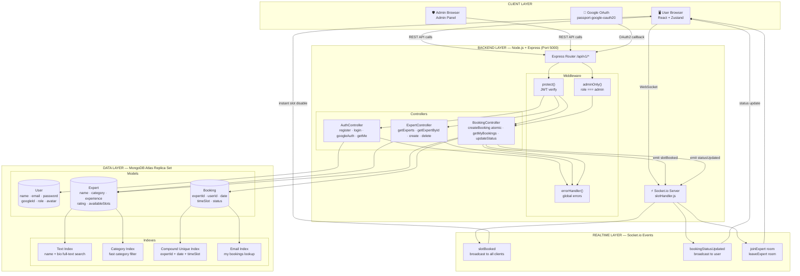
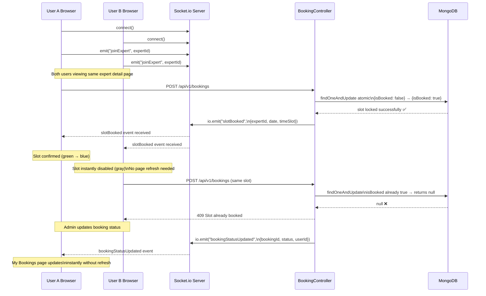
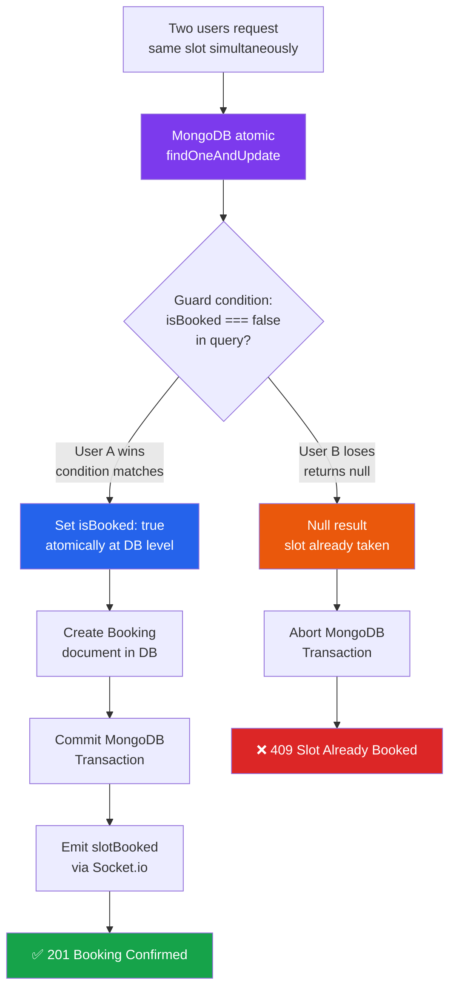
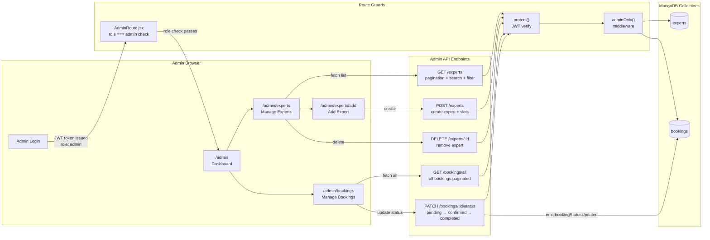
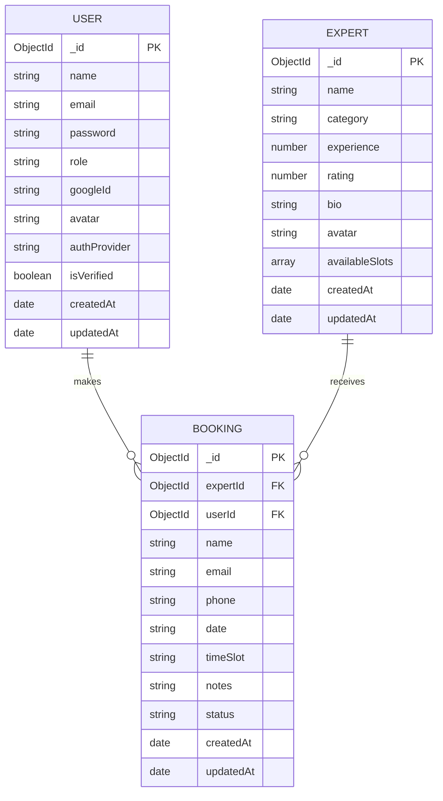

# ExpertBook — Real-Time Expert Session Booking System

A full-stack real-time expert session booking platform built with React, Node.js, Express, MongoDB, and Socket.io. Book sessions with top experts, get real-time slot updates, and manage everything from a powerful admin panel.

---

## Tech Stack

### Backend
| Technology | Purpose |
|---|---|
| Node.js + Express | Server and REST API |
| MongoDB + Mongoose | Database and ODM |
| Socket.io | Real-time slot updates |
| JWT | Authentication tokens |
| bcryptjs | Password hashing |
| Passport.js | Google OAuth 2.0 |
| express-validator | Request validation |
| dotenv | Environment variables |

### Frontend
| Technology | Purpose |
|---|---|
| React + Vite | UI framework |
| Tailwind CSS | Styling |
| Zustand | Global state management |
| React Router DOM | Client-side routing |
| Axios | HTTP requests |
| Socket.io Client | Real-time connection |
| React Hook Form | Form handling |
| Zod | Form validation |
| React Hot Toast | Notifications |

---

## System Architecture



---

## WebSocket Real-Time Flow



---

## Race Condition Prevention Flow



---

## Admin Dashboard Request Flow



---

## Database Schema



---

## API Endpoints

### Auth Routes `/api/v1/auth`

| Method | Endpoint | Access | Description |
|---|---|---|---|
| `POST` | `/auth/register` | Public | Register new user |
| `POST` | `/auth/login` | Public | Login with email + password |
| `GET` | `/auth/me` | Protected | Get current logged in user |
| `GET` | `/auth/google` | Public | Redirect to Google OAuth consent |
| `GET` | `/auth/google/callback` | Public | Google OAuth callback → JWT issued |

### Expert Routes `/api/v1/experts`

| Method | Endpoint | Access | Description |
|---|---|---|---|
| `GET` | `/experts` | Public | Get all experts (paginated + filtered) |
| `GET` | `/experts/:id` | Public | Get single expert with slots grouped by date |
| `POST` | `/experts` | Admin only | Create new expert with available slots |
| `DELETE` | `/experts/:id` | Admin only | Delete expert permanently |

### Booking Routes `/api/v1/bookings`

| Method | Endpoint | Access | Description |
|---|---|---|---|
| `POST` | `/bookings` | Protected | Create booking — atomic race condition safe |
| `GET` | `/bookings?email=` | Protected | Get my bookings by email |
| `GET` | `/bookings/all` | Admin only | Get all bookings paginated + filtered |
| `PATCH` | `/bookings/:id/status` | Admin only | Update booking status |

---

## Query Parameters

### `GET /api/v1/experts`
```
?page=1           page number (default: 1)
?limit=10         results per page (default: 10)
?search=john      full text search on name and bio
?category=Design  filter by category
```

### `GET /api/v1/bookings/all`
```
?page=1           page number (default: 1)
?limit=10         results per page (default: 10)
?status=pending   filter by status — pending / confirmed / completed
```

---

## Socket.io Events

| Event | Direction | Payload | Description |
|---|---|---|---|
| `connect` | Client → Server | — | Client connects to socket server |
| `joinExpert` | Client → Server | `expertId` | Join expert room to receive slot updates |
| `leaveExpert` | Client → Server | `expertId` | Leave expert room on page unmount |
| `slotBooked` | Server → Client | `{expertId, date, timeSlot}` | Slot was booked — disable it instantly |
| `bookingStatusUpdated` | Server → Client | `{bookingId, status, userId}` | Admin updated booking status |
| `disconnect` | Client → Server | — | Client disconnects |

---

## Project Structure

```
expertbook/
├── backend/
│   ├── config/
│   │   └── db.js                    MongoDB connectDB function
│   ├── controllers/
│   │   ├── authController.js        register, login, googleAuth, getMe
│   │   ├── expertController.js      getExperts, getExpertById, create, delete
│   │   └── bookingController.js     createBooking atomic, getMyBookings, updateStatus
│   ├── middleware/
│   │   ├── authMiddleware.js        protect + adminOnly
│   │   └── errorHandler.js          global error handler
│   ├── models/
│   │   ├── schema.js                createSchema factory with default options
│   │   ├── User.js                  user schema + google auth + indexes
│   │   ├── Expert.js                expert schema + slots + text indexes
│   │   └── Booking.js               booking schema + compound unique index
│   ├── routes/
│   │   ├── authRoutes.js            auth + google passport routes
│   │   ├── expertRoutes.js          expert CRUD routes
│   │   └── bookingRoutes.js         booking routes
│   ├── socket/
│   │   └── slotHandler.js           socket.io room management
│   ├── .env
│   ├── .gitignore
│   └── server.js                    entry point
│
└── frontend/
    └── src/
        ├── components/
        │   ├── Navbar.jsx
        │   ├── ExpertCard.jsx
        │   ├── Loader.jsx
        │   ├── ProtectedRoute.jsx
        │   └── AdminSidebar.jsx
        ├── hooks/
        │   └── useSocket.js          socket event hook for real-time slots
        ├── pages/
        │   ├── HomePage.jsx          expert listing + search + filter + pagination
        │   ├── ExpertDetailPage.jsx  expert detail + real-time slots
        │   ├── BookingPage.jsx       booking form with validation
        │   ├── MyBookingsPage.jsx    my bookings + real-time status
        │   ├── LoginPage.jsx
        │   ├── RegisterPage.jsx
        │   ├── AuthSuccessPage.jsx   google oauth token handler
        │   └── admin/
        │       ├── AdminDashboard.jsx  stats overview + recent bookings
        │       ├── AdminExperts.jsx    manage + delete experts
        │       ├── AdminAddExpert.jsx  add expert + slot picker
        │       └── AdminBookings.jsx   all bookings + status update
        ├── services/
        │   ├── api.js                axios instance with interceptors
        │   └── socket.js             socket.io singleton instance
        ├── store/
        │   ├── authStore.js          auth zustand store with persist
        │   └── bookingStore.js       booking zustand store
        └── App.jsx                   all routes
```

---

## Environment Variables

### Backend `.env`
```env
PORT=5000
MONGO_URI=your_mongodb_atlas_connection_string
CLIENT_URL=http://localhost:3000
JWT_SECRET=your_jwt_secret_key
JWT_EXPIRE=7d
GOOGLE_CLIENT_ID=your_google_client_id
GOOGLE_CLIENT_SECRET=your_google_client_secret
GOOGLE_CALLBACK_URL=http://localhost:5000/api/v1/auth/google/callback
```

### Frontend `.env`
```env
VITE_API_URL=http://localhost:5000/api/v1
VITE_SOCKET_URL=http://localhost:5000
```

---

## Getting Started

### Prerequisites
```
Node.js v20.19.0 or higher
MongoDB Atlas account
Google Cloud Console project with OAuth credentials
```

### Backend Setup
```bash
cd backend
npm install
cp .env.example .env
npm run dev
```

### Frontend Setup
```bash
cd frontend
npm install
cp .env.example .env
npm run dev
```

### Backend Packages
```bash
npm install express mongoose dotenv cors socket.io express-validator jsonwebtoken bcryptjs passport passport-google-oauth20
npm install -D nodemon
```

### Frontend Packages
```bash
npm install axios socket.io-client zustand react-router-dom react-hot-toast react-hook-form @hookform/resolvers zod
npm install -D tailwindcss postcss autoprefixer
```

---

## Frontend Routes

```
PUBLIC
  /                       Expert listing — search + filter + pagination
  /experts/:id            Expert detail — real-time slots
  /login                  Login page
  /register               Register page
  /auth/success           Google OAuth redirect handler

PROTECTED (logged in users)
  /booking/:id            Booking form
  /my-bookings            My bookings with real-time status updates

ADMIN ONLY (role === admin)
  /admin                  Dashboard with stats overview
  /admin/experts          Manage + delete experts
  /admin/experts/add      Add new expert with slot picker
  /admin/bookings         All bookings + update status
```

---

## Key Design Decisions

### Atomic Slot Locking
Single `findOneAndUpdate` with `isBooked: false` as guard condition inside a MongoDB transaction. If the document is not found (returns null), the slot is already taken — no separate read needed, no window for a race condition.

### secondaryPreferred Read Routing
All search and listing queries use `.read("secondaryPreferred")` to hit MongoDB secondary replica nodes. Writes and booking operations always hit the primary. This keeps the primary free for consistency-critical operations.

### Socket.io Room System
Each expert has its own socket room (`joinExpert` / `leaveExpert`). When a slot is booked, the server broadcasts only to users in that expert's room — not to all connected clients.

### Compound Unique Index on Bookings
`{ expertId, date, timeSlot }` compound unique index at the database level acts as a second line of defense after the atomic update. Even if two bookings somehow made it through, MongoDB would reject the duplicate.

### Google Auth with partialFilterExpression
The `googleId` field uses `partialFilterExpression: { googleId: { $type: "string" } }` instead of `sparse: true`. This is the modern MongoDB approach — the unique index only applies when `googleId` is actually a string, so multiple local users with `googleId: null` never conflict.

---

## License

MIT